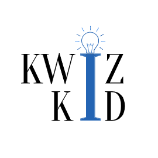

<!DOCTYPE html>
<html lang="en">
  <head>
    <meta charset="UTF-8" />
    <meta name="viewport" content="width=device-width, intial-scale*1.0" />
    <meta http-equiv="X-UA-Compatible" content="ie=edge" />
    <link rel="apple-touch-icon" sizes="180x180" href="/apple-touch-icon.png" />
    <link rel="icon" type="image/png" sizes="32x32" href="/favicon-32x32.png" />
    <link rel="icon" type="image/png" sizes="16x16" href="/favicon-16x16.png" />
    <link rel="manifest" href="/site.webmanifest" />
    <link rel="mask-icon" href="/safari-pinned-tab.svg" color="#5b8ed5" />
    <meta name="msapplication-TileColor" content="#2b5797" />
    <meta name="theme-color" content="#f6feff" />
    <title>KWiZ KiD</title>
    <link
      href="https://fonts.googleapis.com/css2?family=Life+Savers&display=swap"
      rel="stylesheet"
    />
    <link rel="stylesheet" href="app.css" />
  </head>

  <body>
    

      

        

          
        

        <a class="btn" href="game.html">Start Game</a>
        <a class="btn" href="HighScores.html">Highscore</a>
      

    

  </body>
</html>
